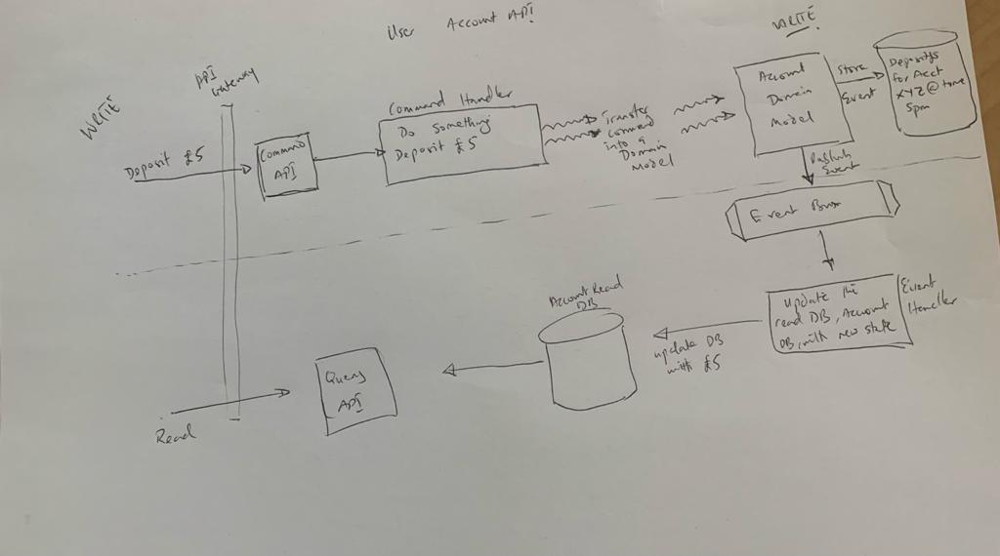

About the POC
=======
This project is designed to illustrate the workings of CQRS:
It consists of 2 servcices broken up based on the CQRS segregation of responsibility:
Commands and Queries.
So the two microservices implemented are the User command service and the User Query service.

The user core project offers a common implementation library for both services. The user api gateway service
is a spring cloud apigateway project and the oauth2 implementation allows us to adopt oauth2 and JWTs for securing endpoints.

The service is segregated along queries and commands.

## What is CQRS and Event Sourcing

CQRS is a design pattern that stands for Command Query Responsibility Segregation. This simply means that we segregate our service in such a way that one service 
alters the state of an application i.e Commands and the other queries the state of the application.
This means that we generate 2 independent services that we can potentially scale differently in the cloud. For instance, an application, for which writes are greater than reads can 
be scaled and monitored accordingly thanks to this segregation, allowing them to be optimized. Event sourcing on the other hand represents a pattern, where all changes made to
an entity are stored as a sequence of immutable events as opposed to the current state. For instance, if I had a bank account table with amount £10, and I withdrew £5,
the Event Sourcing pattern suggests that instead of saving the new state by updating the value in my table, I record the
event in an event store. So the event store will contain:

- Event 1: deposit £10
- Event 2: withdrew £5
- Event 3: ...




## Terminology

- Commands: Usually verbs and consists of actions plus all the information required to complete the action.
- Events: Describes something that has happened. 
- Queries: A desire to understand the state of the system.

## Set up
You will need Docker to run this service.
Each service in this application will run as a separate Docker container.
Since we are not containerizing this applications, and running them in their containers, for now, 
we will run all the applications under the same docker network.
Do ```docker network create --attachable -d overlay obtech```

then do ```docker network ls``` to see all the networks on the host

Since we will be using Axon framework we install the docker Axon server image.

``` docker run -d --name axon-server -p 8024:8024 -p 8124:8124 --network obtech --restart always axoniq/axonserver:latest ```. Observe that we are running this on the same network.
Once done, check ```localhost:8024``` to see the running Axon Server.

Our cmd and query require read and write dbs and for this we will use Mongo db and mysql.
We will use docker for both as well. 

Do: ```docker run -it -d --name mongo-container 
-p 27017:27017 --network obtech --restart always -v mongodb_data_container:/data/db mongo:latest```, 

and then,
```docker run -it -d --name mysql-container -p 3306:3306 --network obtech -e MYSQL_ROOT_PASSWORD=password --restart always -v mysql_data_container:/var/lib/mysql  mysql:latest```


## Implementation

1. create commands
2. create events - events are created after something has happened. The user event objects are 
created in the core API.

###### Aggregates
Create a user aggregate where user commands will be handled and user events generated.
We do this in the UserCommandApi's aggregates package.

1. Annotate the aggregate with @Aggregate annotation to tell axon framework that it is an aggregate
2. We annotate the field with the aggregateIdenifier annotation which helps axon know which aggregate from the command is being targeted

###### Queries

Queries are request from the user to get something in other words we intend to query the
read database.
This can be accomplished without using Axon, but it's probably better to implement this with Axon since we can use
Axon's features such as interceptors and message monitoring.
Our queries will include:
1. A query to find a user by id
2. A query to search for users

###### Annotations

@QueryHandler - Axon annotation, used for annotating methods to handle incoming query requests,
which usually involves querying the read database.

###### Security

1. Spring security & OAuth2 - JWTS
2. For authentication and authorization
- Generate OAUTH2.0 Authorization Server
- Create user service repository so that OAUTH can use the user data to authenticate
- Implement web and auth server configuration classes.
- Configure services to use OAUTH 2, so that the services can verify the JWTs

